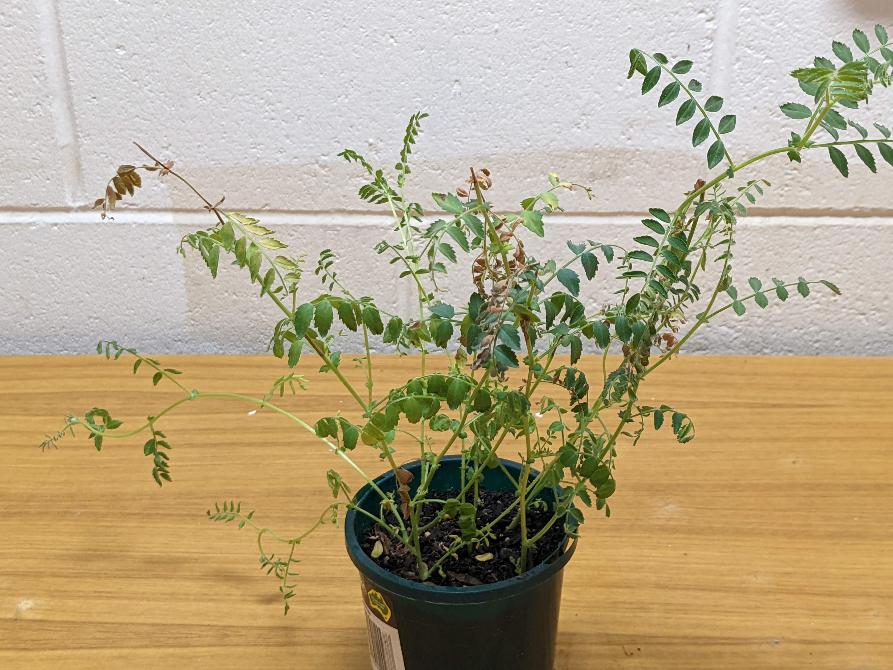
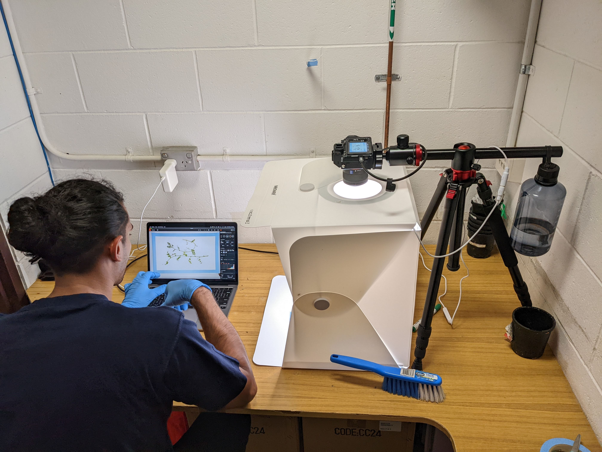

```{r setup, include=FALSE}
# setting up the environment (anything here won't be visible in the document)
knitr::opts_chunk$set(list(echo = TRUE, eval=TRUE, message=FALSE, warning=FALSE))
# options(width = 180)
# CRAN settings
chooseCRANmirror(ind=1)
options(repos = getOption("repos")["CRAN"]) # fix the annoying "unable to access index..."
# packages required for the markdown loaded here, others will be loaded later in the Image Processing section in the Methods
# load/install from GitHub repos
pacman::p_load_gh(char = c("glin/reactable", 
                   "kcuilla/reactablefmtr",
                   "Mikata-Project/ggthemr"),
                        INSTALL_opts = "--no-multiarch")
# CRAN packages
pacman::p_load(knitr, viridisLite, scales)
# Custom Font Format (for package names, etc.)
custom_font="consolas"
fontFmt = function(x,font="consolas"){
  #outputFormat = knitr::opts_knit$get("rmarkdown.pandoc.to")
  #if (outputFormat == 'html')
  formatted_text <- sprintf("<font face='%s'>%s</font>",font,x)
  return(formatted_text)
  #else
  #  x
}
```

## Introduction

*Ascochyta rabiei* is a necrotrophic fungus, causing the Ascochyta blight disease on chickpea, a disease that can cause substantial damage to crops and reduce yield and profits. The disease poses a major risk to the chickpea industry in Australia and worldwide and therefore significant efforts are invested to better understand and monitor the population of *A. rabiei* and identify the most aggressive isolates that are then used to screen breeding material to develop more resistant (or less susceptible) varieties.

The aggressiveness level of *A. rabiei* is determined by assessing the disease symptoms on a differential set of host chickpea varieties/genotypes, in a process that is termed "phenotyping". The Plant Pathology team at the Sustainable Food Production group at Griffith University (led by [Prof Rebecca Ford](https://experts.griffith.edu.au/18969-rebecca-ford) and [Dr Ido Bar](https://experts.griffith.edu.au/8327-ido-bar)) are preforming those assessments annually on a collection of *A. rabiei* isolates collected from the chickpea growing regions in Australia each year. The assessment is performed on 5 weeks old chickpea seedlings that have been inoculated with *A. rabiei* isolates and grown in controlled environment conditions that are conducive for the fungus to establish itself and cause disease on the plants. The exact phenotyping methods are described in [@sambasivamEvidenceRecentIncreased2020; @mehmoodEvidenceConsequenceHighly2017].

### Aims

-   Review machine-learning methods and approaches that can be applied to automatically assess disease symptoms from captured images
-   Apply and optimise selected methods and assess their accuracy, efficiency and correlation with traditional plant pathology visual assessment method

## Methods

### Experimental Design

Disease assessment bioassays were managed and performed by a trained plant pathologist (Melody Christie). Each bioassay included 6 *A. rabiei* isolates which were used to inoculate 5 differential chickpea host genotypes. The assays were performed in a blinded replicated design, where each isolate-host combination was replicated in 2 pots, each containing 5 chickpea seedlings. The seedlings were inoculated at 3 weeks after germination and were assessed 2 weeks post inoculation.

The assessment was then performed for each plant in each pot and the leaf and stem disease scores were assessed (on a qualitative ordinal 1-9 scale), as well as the percentage of the diseased area [@sambasivamEvidenceRecentIncreased2020; @mehmoodEvidenceConsequenceHighly2017]. The disease assessment scores were recorded on a tablet using an online form. An example of a pot with chickpea seedlings infected with Ascochyta blight prior to assessment can be seen in Figure \@ref(fig:diseased-plant) below.

```{r diseased-plant, fig.cap="Chickpea seedlings affected by *Ascochyta rabiei*", out.width="100%"}


```

### Image Capture

An imaging light box ([Neewer Upgraded Photo Light Box, 40x40x40 cm](https://www.amazon.com.au/gp/product/B0921MD235)) with a camera tripod ([Neewer Camera Tripod Monopod with Rotatable Center Column](https://www.amazon.com.au/gp/product/B0734ZZN61)) and a Sony digital camera ([Sony A7III](https://www.sony.com.au/electronics/interchangeable-lens-cameras/ilce-7m3)) that was mounted and operated remotely using Sony's Imaging Edge software, were used to capture images of the diseased plants (see setup in Figure \@ref(fig:image-capture-setup)). Each plant was laid flat in the imaging box and captured by at least 2 images to represent both sides prior to the visual pathology assessment.

```{r image-capture-setup, fig.cap="Image capture setup for disease assessment of *Ascochyta rabiei*", out.width="100%"}


```

### Image Processing for Disease Assessment

#### Tools and Packages

Image analysis and data processing and visualisation were performed in the `r R.version.string` statistical computing environment [@R_2017; @ihakaLanguageDataAnalysis1996]. Specifically, various packages from the [`r fontFmt("tidyverse")`](https://www.tidyverse.org/) collection were used for general data import, wrangling, summary and visualisation and [`r fontFmt("janitor")`](http://sfirke.github.io/janitor/) was used for data cleansing and sanitising [@tidyverse2019; @janitor2021]. The [`r fontFmt("magick")`](https://docs.ropensci.org/magick/) and [`r fontFmt("pliman")`](https://tiagoolivoto.github.io/pliman/index.html) R packages were used for image analysis and automatic disease assessment [@olivotoLightsCameraPliman2022; @magickR2021]. The [`r fontFmt("furrr")`](https://furrr.futureverse.org/) package was used to process the images in parallel along with [`r fontFmt("tictoc")`](https://collectivemedia.github.io/tictoc/) to measure and evaluate processing times [@tictoc2021; @furrr2022].

```{r load-packages}
# load custom functions from Ido's gist
devtools::source_gist("7f63547158ecdbacf31b54a58af0d1cc", filename = "util.R")
# install/load packages in one-liner
library(pacman)
# load/install from GitHub repos
p_load_gh(char = c("TiagoOlivoto/pliman", 
                   "DavisVaughan/furrr", 
                   "HenrikBengtsson/progressr"))
# load/install from CRAN/BioConductor
p_load(tidyverse, magick, tictoc, Microsoft365R, janitor, ISOweek, pliman)

plan(multisession, workers = future::availableCores()-2 ) # automatically detect available cores
```

#### Image Processing

The steps to perform the processing of the images and disease assessment followed the [Phytopatometry](https://tiagoolivoto.github.io/pliman/articles/phytopatometry.html) tutorial of `r fontFmt("pliman")`.\
First, representative palettes of the image background, healthy plant tissue and diseased (symptomatic) plant tissue were sampled from the images and defined (Figure \@ref(fig:define-colours)).

```{r define-colours, fig.cap="Colour palettes representing background (b) colour, healthy (h) tissue and symptomatic (s) tissue", out.width="90%"}
h <- image_import("./palette/h.png")
s <- image_import("./palette/s.png")
b <- image_import("./palette/b.JPEG")
test_plant <- image_import("input_images/test4.JPG")
pliman::image_combine(test_plant, h, s, b)

```

A custom function (`process_image_pliman()`, which can be found in the `src/functions.R` file in [this repository](https://github.com/ChetanRaval/Asco_Phenotyping_ML/blob/main/src/functions.R)) was then written to process the images with the following steps:

1.  Cropping -- removal of the side walls of the light box and any uneven background
2.  Background removal -- set background to transparent (optional step)
3.  Disease assessment using `r fontFmt("pliman")`
4.  Return results as a table with the image-based assessment for each plant in each pot

The function takes as arguments the input file and cropping parameters (pixels to trim from each side of the image), as well as `reference` colour and `fuzz` value to match when removing background (if chosen), an optional flag to save the cropped or no-background images and a flag to determine if the disease assessment should be performed by `r fontFmt("pliman")`. This provides the flexibility to perform just part of the processing each time (just crop images, assess disease on pre-cropped images, etc.). An example of the outputs of each of the image processing steps can be seen in Figure \@ref(fig:processed-images).

To assist with determining the reference colour for the background removal, another function was written, that averages the RGB colour from a range of defined pixels (`avg_bgcolor()`). This function is used internally inside `process_image_pliman()` if the user provides a valid [Magick Geometry](https://docs.ropensci.org/magick/reference/geometry.html) string instead of a Hex colour for the `reference` option.

```{r process-images}
# source image processing functions
source("src/functions.R")
# run the function for 1 image (removing background, cropping and assessing)
process_image_pliman(image_file = "./input_images/test4.JPG", 
                     out_folder = "output/processed_images", 
                     assess_disease = TRUE,
                     crop = TRUE, 
                     save_cropped = FALSE, # should save the cropped file even if FALSE!
                     trans = TRUE,
                     h_pal = h, s_pal = s, b_pal = b)

```

```{r processed-images, fig.cap="Example of the cropping and background removal performed during image processing", out.width="100%"}

cropped_plant <- image_import("output/processed_images/test4_cropped.jpg")
trans_plant <- image_import("output/processed_images/test4_cropped_transparent.png")
pliman::image_combine(test_plant, cropped_plant, trans_plant)
```

After the image processing was validated for one image in a bioassay folder, the rest of the images in the folder were processed in parallel.

```{r process-bioassay, eval=FALSE}
# list of image files in the bioassay folder
bioassay_test <- list.files("../../Image Capture/20220429_Phenotyping", "B001_POT13_.+.JPG", full.names = TRUE)

bioassay_files <- tibble(original_file = list.files("../../Image Capture/20220429_Phenotyping", "B001_POT.+.JPG", full.names = TRUE)) %>% 
  mutate(meta_string=tools::file_path_sans_ext(basename(original_file))) %>% 
  separate(meta_string, into = c("bioassay", "pot", "plant", "replicate")) %>% 
  mutate(pot=as.integer(sub("POT", "", pot, ignore.case = TRUE)), plant=sub("PL", "", plant, ignore.case = TRUE))

step_size <- 20

steps <- seq(1,nrow(bioassay_files), by = step_size)
combined_disease_assessment_results <- vector("list", length = length(steps))
for(i in steps){
  # i =421 
  
  next_step <- min(c(i+step_size-1, nrow(bioassay_files)))
  LogMsg(glue::glue("Processing images {i} to {next_step}, please be patient..."))
   # %>% process_image_pliman()
  tic() # start timer
  with_progress({
    p <- progressor(steps = length(bioassay_files$original_file[i:next_step])) # 
    combined_disease_assessment_results[[which(steps==i)]] <- bioassay_files$original_file[i:next_step] %>% 
      future_map_dfr(.f = ~{
        res_tibble <- process_image_pliman(image_file = .x, 
                                           out_folder = "../../Image Capture/20220429_Phenotyping/processed_images", 
                                           assess_disease = TRUE,
                                           crop = TRUE, 
                                           trim_bottom=350, trim_top=0,
                                           trim_left=0, trim_right=230,
                                           save_cropped = TRUE,
                                           trans = TRUE,
                                           set_fuzz = 18,
                                           reference="#DAD1C8",
                                           start_point = "+5400+3500",
                                           h_pal = h, s_pal = s, b_pal = b)
        p() # because we put this last in the future_map_dfr, the function returned the progressor step instead of the tibble!
        return(res_tibble) # this should fix it...
      }, .options = furrr_options(seed = TRUE)) # this removes the annoying warning about the seed (though I don't think we're generating any random numbers)
  })
  toc() 
  
}
```

### Evaluation of Image-based Assessments

#### Data Collection

After processing the entire images of a bioassay, the images metadata (filename, bioassay, pot, plant) and disease assessment results were combined to a single data table (`tibble`) and summarised per plant (average of symptomatic area of all images).\
The visual pathology assessment data was downloaded directly from the SharePoint site capturing the online form submissions using `r fontFmt("Microsoft365R")` R package [@Microsoft365R2021], combined with the image-based disease assessment data and saved to a `.csv` file.

```{r combine-pathology, eval=FALSE}
# read pathology data 
discard_cols <- c("ID", "Start time", "Completion time", "Email", "Name", "Comments", "Images")
phenotyping_data <- readxl::read_excel("bioassay_test/Ascochyta_rabiei_phenotyping_form_data.xlsx") %>% 
  mutate(date = as.Date(`Start time`), week = ISOweek(date)) %>% 
  select(-one_of(discard_cols)) %>% 
  pivot_longer(contains("Plant"), names_to = "Trait", values_to = "Score") %>% 
  mutate(plant = sub(pattern= "Plant ", "", x = str_extract(Trait, "Plant \\d")), 
         Trait = sub(pattern= "\\s*Plant \\d\\s*", "", Trait),
         Score = as.numeric(Score)) %>%
  clean_names() %>% 
  group_by(bioassay_id, date, pot_number, trait, plant) %>% 
  summarise(score = mean(score, na.rm = TRUE)) %>% 
  pivot_wider(names_from = trait, values_from = score) %>% 
  rename(bioassay = bioassay_id, pot=pot_number)

# combine results ####
# process disease assessment results 
combined_results_df <- map_dfr(combined_disease_assessment_results, bind_rows) %>% # check results and extract metadata from filename
  mutate(meta_string=tools::file_path_sans_ext(basename(original_file))) %>% 
  separate(meta_string, into = c("bioassay", "pot", "plant", "replicate")) %>% 
  mutate(pot=sub("POT", "", pot, ignore.case = TRUE), plant=sub("PL", "", plant, ignore.case = TRUE)) %>% 
  group_by(bioassay, pot, plant) %>% 
  summarise(symptomatic_mean = mean(symptomatic, na.rm = TRUE), 
            assessment_SD=sd(symptomatic, na.rm = TRUE), 
            image_num=n()) %>% 
  left_join(phenotyping_data) %>% relocate(date, .before = 1) %>% 
  write_csv("output/0220429_Phenotyping_processed_data.csv")

```

This processed was then repeated for all the captured images in the bioassay folders and the data was combined and merged with the bioassay design spreadsheet to assign an isolate-host combination for each pot in each bioassay.

#### Statistical Analysis and Visualisation

The correlation between the visual phenotyping disease (leaf and stem 1-9 score and area of diseased tissue) and the image-based diseased symptoms assessment was visualised and assessed using the R packages `r fontFmt("ggstatsplot, ggside, GGally, ggcorrplot")`, as described in [Correlation coefficient and correlation test in R](https://statsandr.com/blog/correlation-coefficient-and-correlation-test-in-r/) [@antoinesoeteweyCorrelationCoefficientCorrelation2020].

```{r plotting-packages}
# load/install from CRAN/BioConductor
p_load(ggstatsplot, GGally, ggcorrplot, ggside, scales)

```

## Results

The images from each phenotyping bioassay were processed as detailed above and summarised per pot and presented in Table \@ref(tab:pliman-table) below.

```{r pliman-results}
# Read processed image data ####
results_files <- list.files("output", pattern = "._Phenotyping_processed_data.csv",
                            full.names = TRUE)

processed_data <- map_dfr(results_files, ~ read_csv(.x) %>% mutate(date=as.Date(date))) %>% 
  clean_names() %>% mutate(across(c("pot", "plant", "image_num"), as.integer))
# summarise data
summarised_data <- processed_data %>% group_by(bioassay, pot) %>% 
  summarise(symptomatic_SD=sd(symptomatic_mean, na.rm=TRUE),
            symptomatic_mean=mean(symptomatic_mean, na.rm=TRUE), 
            lad_percent_mean=mean(lad_percent, na.rm=TRUE), 
            lad_percent_SD=sd(lad_percent, na.rm=TRUE),
            leaf_score_mean=mean(leaf_score, na.rm=TRUE), 
            leaf_score_SD=sd(leaf_score, na.rm=TRUE),
            stem_score_mean=mean(stem_score, na.rm=TRUE), 
            stem_score_SD=sd(stem_score, na.rm=TRUE),
            plant_num = n(),
            image_num = sum(image_num)) %>% 
  relocate(symptomatic_SD, .after = symptomatic_mean) %>% 
  ungroup() %>% 
  arrange(bioassay, pot) 
# prepare table for report
table_data <- summarised_data %>% select(-ends_with("SD")) %>% 
  mutate(across(any_of(c("symptomatic_mean", "lad_percent_mean")), 
                .fns = ~./100),
         across(where(is.double), .fns = ~round(., digits = 2) )) %>% 
  set_names(snakecase::to_title_case(names(.), abbreviations = "LAD"))
```

```{r results-table, results='asis', echo=FALSE, out.width="100%"}
DT_caption("pliman-table", "Disease assessment comparison table")

reactable(table_data, 
          columns = list(
            "Symptomatic Mean" = colDef(
                cell = data_bars(table_data, 
                     fill_color = rev(viridisLite::inferno(10)), 
                     background = "lightgrey",
                     text_position = "above", 
                     round_edges = TRUE, 
                     # force_outside = c(0,0.4),
                     max_value = 1, 
                     number_fmt = scales::percent)
              ),
            "LAD Percent Mean" = colDef(
                cell = data_bars(table_data, 
                     fill_color = rev(viridisLite::inferno(10)), 
                     background = "lightgrey",
                     text_position = "above", #  "inside-end", 
                     round_edges = TRUE, 
                     # force_outside = c(0,0.4),
                     max_value = 1, 
                     number_fmt = scales::percent)
              ),
            "Leaf Score Mean" = colDef(
                cell = data_bars(table_data, 
                     fill_color = rev(viridisLite::inferno(10)), 
                     background = "lightgrey",
                     text_position = "above", 
                     round_edges = TRUE, 
                     # force_outside = c(0,4),
                     max_value = 9)
              ),
            "Stem Score Mean" = colDef(
                cell = data_bars(table_data, 
                     fill_color = rev(viridisLite::inferno(10)), 
                     background = "lightgrey",
                     text_position = "above", 
                     round_edges = TRUE, 
                     # force_outside = c(0,4),
                     max_value = 9)
              )
            

  ),
  resizable = TRUE, bordered = TRUE, striped = TRUE, highlight = TRUE)

```

The correlation between the visual pathology and image-based disease assessments were plotted and assessed. The pairwise correlation between all measured variables is seen in Figures \@ref(fig:pairwise-cor),\@ref(fig:cor-matrix).

```{r pairwise-cor, fig.cap="Pairwise correlations between image-based and visual pathology disease assessment methods for _A. rabiei_"}
# Check correlation between all traits 
cor_data <- summarised_data %>% select(symptomatic_mean, lad_percent_mean, 
                                       leaf_score_mean, stem_score_mean) %>% 
  setNames(snakecase::to_any_case(names(.), case = "title", abbreviations = "LAD"))
ggpairs(cor_data)

```

```{r cor-matrix, fig.cap="Correlations matrix of image-based and visual pathology disease assessment methods for _A. rabiei_"}
# Check correlation between all traits 
# plot correlation matrix
ggcorrmat(
  data = cor_data,
  type = "parametric", # parametric for Pearson, nonparametric for Spearman's correlation
  colors = c("darkred", "white", "steelblue") # change default colors
)

```

A more focused view of the correlation between the visual pathology assessment and the image-based assessment performed by `r fontFmt("ggstatsplot")` can be seen in Figure \@ref(fig:lad-pliman-cor).

```{r lad-pliman-cor, fig.cap="Correlation between image-based and visual pathology disease assessment methods for _A. rabiei_"}
pale_theme <- ggthemr(palette = "pale", set_theme = FALSE, text_size = 14)
# ggplot(processed_data, aes(x=symptomatic_mean , y=lad_percent))
ggscatterstats(
  data = summarised_data,
  x = symptomatic_mean,
  y = lad_percent_mean,
  bf.message = FALSE
) + pale_theme$theme +
  # geom_errorbar(mapping = aes(ymin = lad_percent_mean - lad_percent_SD, 
  #                             ymax = lad_percent_mean + lad_percent_SD)) +
  # geom_errorbarh(mapping = aes(xmin = symptomatic_mean - symptomatic_SD, 
  #                             xmax = symptomatic_mean + symptomatic_SD)) +
  labs(y = "LAD (%)", x = "Symptomatic area (%)")

```

## Conclusion

Overall `r sum(processed_data$image_num)` images of diseased plants were processed, representing `r nrow(processed_data)` plants (`r length(unique(processed_data$pot))` pots of 35 isolate-host combinations). We observed moderate-high correlation ($R^2=0.65$) between the image-based disease assessment and the visual pathology assessment. The correlation between the qualitative stem and leaf disease scores and visual assessment of diseased leaf area (LAD %) was significantly better than the image-based computed assessment, indicating that there are still further improvements to be achieved to increase the accuracy of the model. However, the results are promising and demonstrate the advantages of image-based assessments, which are faster, do not require expert pathologists (therefore cheaper) and are not subjective, hence less biased by the individual assessor's skills, knowledge, mental state, fatigue, etc.

## General information

This document was last updated at `r Sys.time()` using R Markdown (built with `r R.version.string`). Markdown is a simple formatting syntax for authoring HTML, PDF, and MS Word documents. It is especially powerful at authoring dynamic documents and reports which can showcase and execute code chunks and use the results in the output. For more details on using R Markdown see <http://rmarkdown.rstudio.com> and [Rmarkdown cheatsheet](https://www.rstudio.com/wp-content/uploads/2016/03/rmarkdown-cheatsheet-2.0.pdf).

------------------------------------------------------------------------

## Bibliography

<!-- ```{r results='asis', eval=TRUE} -->

<!-- PrintBibliography(biblio) -->

<!-- ``` -->
